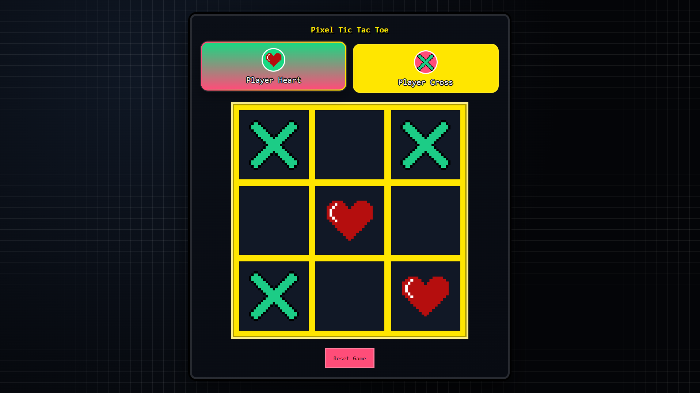

# Pixel Tic Tac Toe

A simple 2-player Tic Tac Toe game built with React + TypeScript + Vite, with a pixel-style UI.

## Features
- 3x3 board
- Turn-based gameplay
- Win and draw detection
- Pixel-style game-over popup
- Reset / play again

## Screenshot


## Run Locally
```bash
npm install
npm run dev
```

## Build
```bash
npm run build
```
